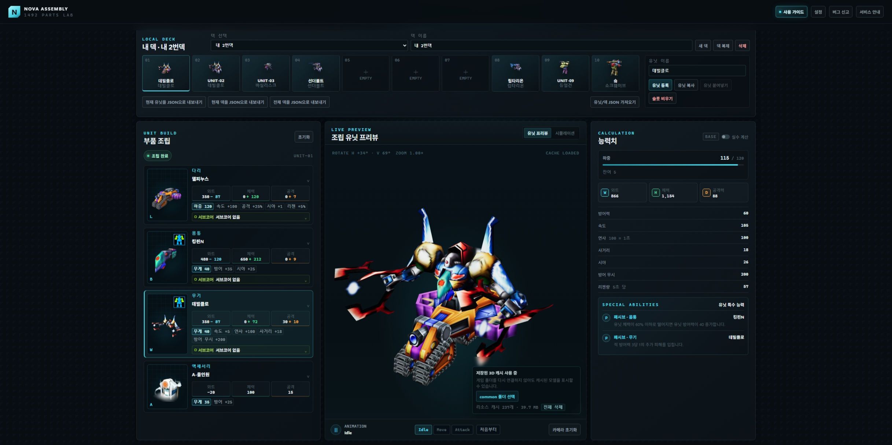

# Nova Parts Calculator Web



노바 1492 부품 계산기와 사용자 승인 기반 로컬 GX 3D 미리보기를 제공하기
위한 웹 프로젝트입니다.

React, TypeScript, Vite 기반으로 계산 엔진, 10슬롯 로컬 덱, JSON 백업,
사용자 승인 기반 GX/XFI 3D 미리보기를 구현합니다. 덱과 변환 모델은 브라우저
IndexedDB에 저장되며 원본 게임 리소스는 서버로 전송하지 않습니다. 제품
요구사항과 구현 원칙은 `AGENTS.md`를 따릅니다.

## 문서

- [Cloudflare Pages 배포 및 운영 가이드](./docs/deployment-operations.md)
- [계산 엔진](./docs/calculation-engine.md)
- [카탈로그 스키마](./docs/catalog-schema.md)
- [작업 로드맵](./TASKS.md)
- [오픈소스 및 제3자 라이선스](./public/THIRD_PARTY_LICENSES.txt)
- [보안 정책 및 비공개 취약점 신고](./SECURITY.md)

## 개발 명령

```powershell
npm install
npm run dev
```

## 검증 명령

```powershell
npm run typecheck
npm run lint
npm run test:run
npm run build
```

기준 Python 계산 결과를 사용해 기본 계산 골든 데이터를 다시 생성하려면 다음
명령을 사용합니다.

```powershell
npm run calculation:golden
npm run calculation:golden:final
npm run calculation:golden:validation
```

## 부품 카탈로그 갱신

형제 디렉터리의 `Nova-Parts-Calculator-Python` 기준 저장소에서 카탈로그를
다시 가져오려면 다음 명령을 사용합니다.

```powershell
npm run catalog:import
```

다른 위치에 있는 기준 저장소는 첫 번째 인자로 경로를 전달합니다.

```powershell
npm run catalog:import -- C:\path\to\Nova-Parts-Calculator-Python
```

브라우저 E2E 테스트를 처음 실행할 때는 Playwright 브라우저를 설치합니다.

```powershell
npx playwright install chromium firefox
npm run test:e2e
```

E2E 테스트는 Chromium과 Firefox의 데스크톱 핵심 흐름, 모바일 Chromium의
하단 탭 전환, WCAG A·AA 자동 검사와 대화상자 키보드 포커스를 검증합니다.
덱 테스트는 격리된 브라우저 저장소를 사용하므로 실제 사용자의 IndexedDB
덱에는 영향을 주지 않습니다.

원본 GX, XFI, 텍스처와 로컬 변환 산출물은 저장소에 커밋하지 않습니다.

## 라이선스와 기여자

이 웹 프로젝트의 직접 작성 코드는 [MIT License](./LICENSE)로 배포합니다.
계산 공식과 기존 동작은 MIT 라이선스의
[Nova Parts Calculator](https://github.com/ThunderVolt45/Nova-Parts-Calculator-Python)를
기준으로 이식했으며, 원본 Git 기록의 기여자 `ThunderVolt45`와 `cam900`의
저작권 및 라이선스 고지를 보존합니다. GX/XFI 파싱과 3D 변환은 MIT 라이선스의
[Nova 1492 GX Unpacker](https://github.com/ThunderVolt45/Nova-1492-GX-Unpacker)를
기준으로 구현했습니다.

MIT 라이선스는 직접 작성한 프로그램 코드와 해당 기준 프로젝트 코드에만
적용됩니다. Nova 1492 명칭·상표·원본 게임 데이터와 게임 자산의 권리는 각
권리자에게 있으며 이 저장소는 그 권리를 부여하지 않습니다.

## CI/CD

GitHub의 `main`에 커밋이 push되면 GitHub Actions가 타입 검사, 린트, 단위
테스트, Chromium·Firefox E2E 테스트와 프로덕션 빌드를 실행합니다. 연결된
Cloudflare Pages 프로젝트는 같은 `main` push를 감지해 프로덕션을 자동
배포합니다. 자세한 구성과 운영 절차는
[배포 및 운영 가이드](./docs/deployment-operations.md)를 따릅니다.
